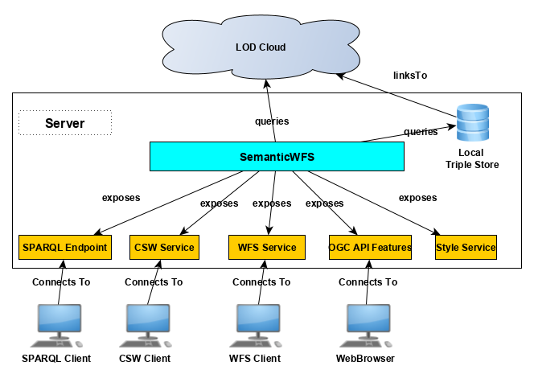

# semanticwfs
Semantic WFS with a Linked Data Backend

This project is a Java wrapper connecting to a triple store and exposing results of SPARQL queries including a geometry literal as a WFS geospatial webservice.

The project maps FeatureTypes to SPARQL queries and allows the configuration of said SPARQL queries in a webinterface.

This webservice supports the following WFS types:

* WFS 1.0, 1.1.0 and 2.0
* OGC API Features Core, OGC API Features CRS and OGC API Features CQL partly

## Getting started

Currently, there are two ways to deploy the SemanticWFS service.

### Installation using Docker

To deploy the SemanticWFS using Docker, you can follow these steps:

* Clone the repository
* Modify the triplestoreconf.json and wfsconf.json according to your needs
* Build the application war file using Maven
* Build the Docker image
* Deploy the Docker image

A Gitlab CI workflow is included in this repository.

### Installation as a web application using Tomcat

To deploy the SemanticWFS as a web application in tomcat, you can follow these steps:

* Build the application using Maven
* Copy and/or modify the following configuration files into the Tomcat root folder:
  * htmltemplate.txt
  * htmltemplate2.txt
  * htmlcovtemplate.txt
  * triplestoreconf.json
  * wfsconf.json
* Copy the resulting .war file into the tomcat webapps directory

A machine readable version of this installation process is documented in the included Dockerfile.

## Supported literal types

The SemanticWFS currently supports reading the following literal types found in RDF graphs:

* OGC WKTLiterals as defined in the GeoSPARQL standard
* OGC GMLLiterals as defined in the GeoSPARQL standard
* GeoJSON literals
* Well-Known-Binary literals

## Export formats

The SemanticWFS currently supports the following formats for export:

  * RDF Serizalizations:  [HexTuples](https://github.com/ontola/hextuples), [JSON-LD](https://json-ld.org/spec/latest/json-ld/), [N-Triples](https://www.w3.org/TR/n-triples/), [Notation3](https://www.w3.org/TeamSubmission/n3/), [NQuads](https://www.w3.org/TR/n-quads/), [RDF/JSON](https://www.w3.org/TR/rdf-json/), [RDF/XML](https://www.w3.org/TR/rdf-syntax-grammar/), [TriG](https://www.w3.org/TR/trig/), [TriX](https://www.hpl.hp.com/techreports/2004/HPL-2004-56.html), [TTL](https://www.w3.org/TR/turtle/)
  * Vector geometry formats: [GeoJSON](https://geojson.org/), [GeoJSON-LD](https://geojson.org/geojson-ld/), [GeoURI](https://geouri.org), [KML](https://www.ogc.org/standards/kml/), [GML](https://www.ogc.org/standards/gml), 
  [GPX](https://www.topografix.com/gpx.asp), LatLonText, [MapML](https://maps4html.org/MapML/spec/), [OSM/XML](https://wiki.openstreetmap.org/wiki/OSM_XML), [SVG](https://www.w3.org/Graphics/SVG/), [WKT](https://www.ogc.org/standards/sfa), [HexWKB](https://www.iso.org/standard/40114.html)
  * Coverage-centric formats:
     * [CoverageJSON](https://covjson.org) to display Points, LineStrings, Polygons and GridCoverages
     * [XYZASCII](https://gdal.org/drivers/raster/xyz.html) to display coverage data or simply a list of points
  * Multiple purpose formats: [CSV](https://tools.ietf.org/html/rfc4180), [JSON](https://www.json.org/json-en.html), [JSONP](http://jsonp.eu), [ODS](http://www.openoffice.org/sc/excelfileformat.pdf), [XLS](http://www.openoffice.org/sc/excelfileformat.pdf), [XLSX](http://www.openoffice.org/sc/excelfileformat.pdf), [YAML](https://yaml.org)
  * Binary formats: [BSON](http://bsonspec.org/), [RDF/EXI](https://www.w3.org/TR/exi/), [RDF/Thrift](https://afs.github.io/rdf-thrift/)
  * Streaming formats: [JSON Sequential](https://tools.ietf.org/html/rfc7464), [GeoJSON Sequential](https://github.com/geojson/geojson-text-sequences)

## Adding Triple Stores

Triple stores can be added to the SemanticWFS using the triplestoreconf.json file. The file needs a SPARQL endpoint address, and certain configurations:

    
    {
      "name":"Triple Store Configuration",
      "prefixes":{
        "http://www.adv-online.de/namespaces/adv/gid/6.0#":"aaa6",
        "http://www.opengis.net/gml/3.2#":"gml",
        "http://www.wikidata.org/entity/":"wd"
       },
        "endpoints":{
          "https://query.wikidata.org/sparql":{
            "endpoint":"https://query.wikidata.org/sparql","epsg":4326, 
            "name":"Wikidata",
            "type":"http://www.wikidata.org/prop/direct/P31",
            "geo":["http://www.wikidata.org/prop/direct/P625"],
            "label":"http://www.w3.org/2000/01/rdf-schema#label",
            "bboxlimit":500
          }
        }
      }
    }
    
A triple store needs a queryable SPARQL endpoint address and a designation (name) to identify it in the SemanticWFS configuration.
In addition, several property names need to be given to the SemanticWFS in order to create correctly formatted queries:
* type-Property: The property depicting the relation *rdf:type* in the respective triplestore
* geo-Property: A list of properties depicting geometry literals in the respective triplestore
* label-Property: A property which represents the property used for labels

Finally, a limit for boundingbox queries may be defined. A bounding box query is sent on initialization to get bounding boxes for the respective feature collections defined for the triple store.

## Adding Collections

Once a triple store has been configured in the SemanticWFS implementation, a OGC API Feature Collection may be defined from a SPARQL query and a CRS definition.
These collections are stored in the wfsconf.json configuration file.

    {
      "baseurl":"https://www.i3mainz.de/projekte/bkg/semanticwfs",
      "servicetitle":"BKG WFS Service",
      "servicedescription":"Testwebservice with a Triple Store backend",
      "datasets":[
        {
          "namespace":"http://www.wikidata.org/entity/",
          "indvar":"item",
          "useorderby":true,
          "description":"Cities in Wikidata",
          "geometrytype":"Point",
          "targetCRS":"EPSG:4326",
          "class":"http://www.wikidata.org/entity/Q515",
          "query":"SELECT ?item ?itemLabel ?the_geom WHERE{ ?item wdt:P31 wd:Q515 . ?item wdt:P625 ?the_geom . SERVICE wikibase:label { bd:serviceParam wikibase:language '[AUTO_LANGUAGE],en'. } }",
          "triplestore":"https://query.wikidata.org/sparql",
          "type":"WFS",
          "name":"WikidataCity"
        }
      ]
    }

The wfsconf includes as baseurl which configures the URL under which the SemanticWFS will be hosted, the name of the webservice and a servicedescription.
To add a new feature collection, the datasets array needs to be extended with a JSON object formatted as follows:
* *name*: The name of the FeatureCollection as it should appear in the SemanticWFS interface
* *description*: A short description of the FeatureCollection to be defined
* *type*: The type of FeatureCollection, either vector data (WFS) or raster data (WCS)
* *query*: The SPARQL query to retrieve the FeatureCollection. The SPARQL query needs to include the variable defined in the indvar property and at least one variable ending in _geom to identify the geometry literal.
* *triplestore*: The address of the SPARQL endpoint
* *indvar*: The variable in the SPARQL query which retrieves instances
* *targetCRS*: The CRS used for geometries which are queried from the triple store defined as an EPSG code
* *useorderby*: Adds an orderBy statement to the query (may run into performance issues in certain triple stores
* *class*: The main class to be queried. Should be the same class as defined in the SPARQL query
* *geometrytype*: The type of geometry which is expected as a result from the SPARQL endpoint. Relevant for downlift formats which only allow to only represent one geometry type.
* *namespace*: The namespace used for the classes which are queried
